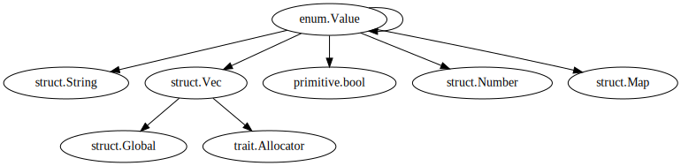

# what-the-struct
Scrapes docs.rs to build a graph of struct constituents
```console
$ what-the-struct --url 'https://docs.rs/serde_json/latest/serde_json/enum.Value.html' \
   | dot -Tsvg -o Value.svg
```
